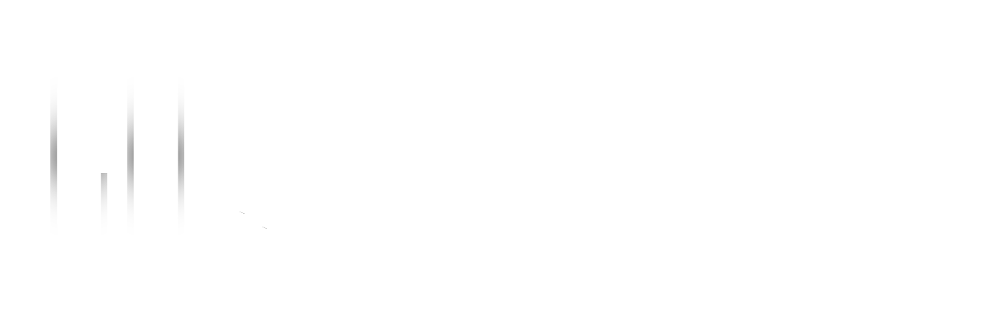

   v0.4

> The first NFT marketplace focused on luxury collectible assets.

## Overview

Grandma-Factory is a **decentralized finance platform** focused on luxury and collectible products.
We use blockchain technology to provide exceptional assets for all.

### Objectives

Grandma-Factory offers a decentralized finance platform for investing in a wide range of luxury goods.
Whisely selected investments in collectors' markets can be very profitable. Only a tiny minority of the world's population has access to them today. 
Grandma-Factory is working to change this limiting reality and is opening up this asset class to decentralized finance (DeFi) by offering tangible, anti-fragile and secure assets at a time of economic uncertainty around the world.

### Approach

> Grandma-Factory is based on Ethereum to take advantage of the most widespread blockchain platform.

We use proven smart-contract mechanisms to provide **robust assets** that are compatible with current decentralised finance tools.  
To distribute value on the Ethereum network, Grandma-Factory creates **NFTs** that are fully backed by real assets.  
These NFTs are **fractionable** in order to open this market to all categories of investors.  

Grandma-Factory also structures thematic funds composed of several assets, thus allowing an investment with more liquidity and stability.
A web application allows you to browse the list of assets under management and interact with the various smart-contracts on the platform.  

We would like to offer owners of exceptional properties the opportunity to sell them within our **incubator** to feed the platform with new assets.  
These properties must of course be appraised beforehand by Grandma-Factory in order to set the selling price in the incubator.
In addition, the selling costs are significantly lower than those of the auction houses.  

Grandma-Factory is committed to the conservation of the assets it holds. In order to guarantee the durability of the investments, the assets are kept in the best conditions of maintenance and security by Grandma-Factory.

### Roadmap

  

### Targeted markets

> Grandma-Factory is intended to be generic and potentially addresses all luxury markets.

Several areas have already been identified such as **watches, cars, art, wine**, and various collectors' markets.
Grandma-Factory will address the markets described below according to the total amount raised during the ICO.

  

#### Watches

The market for luxury watches is buoyant and unavoidable. 
Prestige watches are an important segment that attracts a huge number of investors worldwide.
We can mention emblematic brands such as, **Rolex, Audemard Piguet, Jaeger Lecoultre, Breguet**, some of whose models have become fruitful investments for many collectors.

#### Cars

The second market targeted by Grandma-Factory is the automotive industry, which has a large following.

Two axes are envisaged:
That of the classic car market, a milieu of enthusiasts and a must for investors looking for a reliable investment.
And that of the exceptional vehicle, often represented by ultra-sporty cars produced in very limited quantities.

This market is booming all over the world but is not easily accessible to most people. Grandma-Factory offers all investor profiles the possibility to position themselves easily and reliably in a buoyant market.  

#### And much more

Grandma-Factory aims to offer a maximum of sectors to provide crypto-currency holders with multiple possibilities to diversify their assets.
Several of these areas, already identified, will be added to the platform over time (works of art, luxury accessories, wine, etc.)

## Grandma Platform

The Grandma-Factory platform is accessible through a web application. 
The primary objective of the platform is to provide the user with an efficient way to browse the various assets available.
Users can consult the list of assets in their possession in a dedicated section.
In addition, this application offers users all the functionalities necessary for interaction with the various smart-contracts.

### Grandma NFTs

A Grandma NFT (Non-Fungible Token) is a unique digital asset that represents ownership of a real physical asset. 
**Grandma-Factory guarantees that the underlying asset is retained by the company and therefore ensures the value of the NFT.**

For each Grandma NFT, Grandma-Factory publishes the documents useful for the valuation of the real asset. 
These documents are distributed on the IPFS (InterPlanetary File System) and are accessible at any time by the platform's users.
Users can buy and sell shares in Grandma F-NFT (detailed below).

### Grandma F-NTFs (Fractional-NFTs)

A Grandma F-NFT (Fractional-NFTs) is an Grandma NFT whose ownership is distributed through a token complying with the ERC-20 standard. 
This type of NFT allows the user to buy a fraction of the NFT rather than the whole of it. 
It makes the purchase of NFT more accessible and encourages the participation of a wider range of investors in the ecosystem.

Grandma F-NFTs are listed on the Grandma-Factory platform and users can buy or sell these fractions.

### Grandma Incubator

In order to feed the platform with new assets, Grandma-Factory offers private or institutional sellers the opportunity to sell their assets in the form of Grandma NFTs within the platform's **incubator**. 
This incubator allows the creation of new Grandma NFTs available for purchase.
These assets must be appraised upstream in order to offer them at relevant prices in line with the market.
Once their selling prices have been reached, Grandma-Factory purchases the goods and holds them in its reserves.

To purchase a Grandma NFT from the incubator, the user has two options:

1. Buy the entire Grandma NFT at the set price. In this case, the sale is effective immediately.
2. Financing a fraction of the Grandma NFT. In this case, if the sum of the fractions sold covers the entire price set, the NFT will be mutated into an F-NFT and the fractions distributed to each participant.

  

### Grandma ASCs

Grandma-Factory offers users a concept called **AlmostStableCoin**. An Grandma ASC is a token complying with the **ERC-20** standard. It is characterized by being collateralized by a set of Grandma-Factory assets. Therefore, it can be composed of Grandma NFTs, fractions of Grandma F-NFTs and also other Grandma ASCs. The value of a Grandma ASC reflects the cumulative value of its various assets.  
ASCs are thematic and allow investors to target a market while benefiting from diversification across multiple assets.
The ASC smart-contract is the owner of the assets that make it up and the blockchain attests to its status at all times.

The Grandma ASCs are listed on the web application.
In addition, the user can consult the technical characteristics of each Grandma ASC (smart-contract address, number of tokens, composition, etc.).
It can also view the composition of the token as well as the valuation of the token against the real assets.

  

### Future services

#### Liquidity Pools

The **Liquitidy Pools** allows users to invest their tokens (Grandma-Tokens & ASCs) on the Grandma-Factory platform in order to be rewarded by different decentralized protocols. 

Grandma-Factory wants to offer users liquidity pools directly on its platform. We will distribute liquidity on DeFi's protocols by optimising the return on the Pools in order to best remunerate the participants. 

#### Investment Pools

Grandma-Factory plans to offer **Investment Pools** which will serve as a gateway to raise the funds necessary for the growth of ASCs. These funds will be blocked for a predetermined maximum period and remunerated by Grandma-Tokens.
Grandma-Factory will use this lock-in period to select and acquire the new assets to be added to the ASC.

At the end of the process, the investor receives the equivalent of their stake in ASC tokens as well as the Grandma-Token reward tokens.

#### Grandma Republic

Grandma-Factory wishes to offer Grandma-Token (GMA) holders the possibility to participate in the choice of future developments of the platform. To do so, we will set up a community voting system called **Grandma Republic** which will be open to Grandma-Token holders.

Users with Grandma-Tokens (GMAs) will be able to vote for: 
1. Add a specific asset to Grandma NFTs.
2. Add a Grandma ASC on a specific theme.
3. Choose the future domain addressed by the platform.

#### Borrow and Lending

Grandma-Factory wants to enable Grandma token holders to obtain pawn loans.
These mechanisms will be decentralised and implemented in smart contracts.
The user may request a loan against the pledge of a Grandma NFT, a Grandma ASC, or the Grandma-Token.
It will also be able to lend out its assets in order to earn a return.

#### Price Oracle

In order to offer new perspectives on the platform, Grandma-Factory plans to implement price oracles for its different assets. These oracles will allow the integration of new decentralized features by providing real-time data on asset valuations to smart-contracts.

#### OTC market

Grandma-Factory wants to offer an tailor-made service to private and instituionnal investors by providing an OTC (Over-the-Counter) market. It will allows a greater flexibility in transactions and the ability to customize financial products to meet specific needs. 

## Transparency commitments

Grandma-Factory wants to build a seamless ecosystem and this is achieved through several axes which are developed below.

### Open Source 

The smart-contracts published by Grandma-Factory are entirely **Open Source** in order to offer users maximum transparency regarding interactions with the blockchain.

### Smart-contracts audits

The codes developed by Grandma-Factory will be audited by at least one major DeFi audit actor. Grandma-Finance also commits to setting up bounty programs for the research of security vulnerabilities.

The smart-contracts developed by Grandma-Factory will be audited by at least one major player in the audit of decentralized finance.
Grandma-Factory is committed to implementing bounty programs for the investigation and publication of security flaws.

### Assets audits

Grandma-Factory wants to give the community the means to verify the assets held by the company.
In order to do so, Grandma-Factory will apply to the competent authorities of the countries in which it will hold the goods. 
For example, in France, Grandma-Factory will periodically call upon bailiffs to ascertain and certify the holding of the platform's goods.
The various reports will be published by Grandma-Factory to ensure full transparency. 

### Company's funds

Grandma-Factory will keep the company's funding reserve on the Ethereum blockchain. The management of this reserve will be public and linked to the company Ethereum domain (ENS) funds.grandma-digital.eth. Grandma-Factory commits not to put the company's funds at risk on any DeFi or CeFi platform. Grandma-Factory reserves the right to participate in Ethereum staking system with its inactive funds.

Grandma-Factory will hold the company's crypto-assets on the Ethereum blockchain. 
The management of this crypto assets will be public and attached to the ENS funds.grandma-factory.eth domain name.
Grandma-Factory is committed to not putting the company's funds at risk on any decentralized/centralized finance platform.
Grandma-Factory reserves the right to participate in the proof of stake of the Ethereum network with its inactive funds.

## Token Economics (Tokenomics)

### Grandma-Token (GMA)

Grandma-Token (GMA) is the Grandma-Factory platform utility token. 
This token has several uses described below:

1. The GMA provides liquidity on the various ASCs offered on the platform.
2. GMA allows users to pay at discount for the platform fees.
3. Holding GMAs allows users to earn rewards by stacking their tokens.
4. The governance of the Grandma-Factory platform involves the GMA token holders.
5. The GMA will be used to remunerate users for future services of the platform.

Other use cases will be assigned to the GMA token as the ecosystem develops and growth.

**Characteristics** of the GMA token :

- Ticker: **GMA**
- Chain: **Ethereum** 
- Type: **ERC777** (ERC20 Compatible)
- ICO Token Price: **1 GMA = 0.005 USD**
- Fundraising Goal: **1,500,000 USD**
- Total Tokens: **10,000,000,000 GMA**
- Team distribution schedule: **10% each 3 months**

Unsold tokens will be burned at the end of the ICO.

**Distribution** of the GMA token :

- 7,000,000,000 Public sale
- 500,000,000   Presale
- 1,000,000,000 Ecosystem
- 1,000,000,000 Development fund
- 250,000,000   Marketing
- 250,000,000   Community rewards

### Grandma-Reward

The Grandma-Reward program is a unique staking program that allows users to collect a portion of the platform fees.
When a user performs a transaction on the Grandma-Factory platform, a fee is charged. **15%** of these fees will be redistributed within the Grandma-Reward program.

To benefit from this remuneration, the user must stack Grandma-Token tokens on a Grandma-Reward pool. 
In exchange for locking these tokens, the user receives pool tokens that activate the rewards system.

Users can increase their yield by staking a certain amount of tokens. 
Three reward levels are identified in this regard:

- **Cotton**, boost by a **1.15x** multiplier for locking a minimum of **10,000 GMA**
- **Kashmir**, boost by a **1.5x** multiplier for locking a minimum of **500,000 GMA**
- **Silk**, boost by a **3x** multiplier for locking a minimum of **10,000,000 GMA**
  
The Grandma-Reward pools will respect the following mathematical rules:
  
- Stacking formula:
$$
\begin{aligned}
& L_i \rArr \text{Total Pool tokens (PT)} \\
& S_i \rArr \text{Total GMA in pool} \\
& n \rArr \text{Stacked GMA tokens} \\
\end{aligned}
$$

$$
\begin{aligned}
PT(\relax{n}) = \frac{n*L_i}{S_i}
\end{aligned}
$$
  
- Unstacking formula:
$$
\begin{aligned}
& L_i \rArr \text{Total Pool tokens} \\
& S_i \rArr \text{Total GMA in pool} \\
& u \rArr \text{Unstacked Pool tokens} \\
\end{aligned}
$$

$$
\begin{aligned}
GMA(\relax{u}) = \frac{u*S_i}{L_i}
\end{aligned}
$$
  
- Fees redistibution formula:
$$
\begin{aligned}
& S_i \rArr \text{Total GMA in pool} \\
& R \rArr \text{Total GMA reward} \\
& R_i \rArr \text{Pool GMA reward} \\
& B_i \rArr \text{Pool multiplier} 
\end{aligned}
$$

$$
\begin{aligned}
R_i = R * \frac{S_i * B_i}{ \textstyle\sum_{k} S_k * B_k }
\end{aligned}
$$
    
The second benefit is increased influence within the Grandma-Republic system.
The "Cotton", "Kashmir" and "Silk" levels have **2x**, **3x** and **5x** more influence in the votes cast for the community respectively.

These awards are given as an indication, Grandma-Factory reserves the right to ajust them.

## Platform technical ecosystem

  

## Terms and conditions

The Grandma-Factory platform and the Grandma-Token are products of Grandma Group LLC, whose official website is https://grandma.digital.
By accessing the website at https://grandma.digital, you agree to be bound by these Terms of Use, all applicable laws and regulations, and agree that you are responsible for compliance with all local laws that apply to you. You may not use or access this site if you do not agree with any of these terms. The contents of this website are protected by applicable copyright and trademark laws.

### Legal Disclaimers

This document is not an offer to invest, or to buy Grandma-Token tokens, or to invest in any securities, or a collective investment scheme. This crowdfunding campaign aims to support the development of the project, and participants should not expect anything in return. All contributors will be rewarded as explained in the terms of the campaign. By participating in this event, you understand that you are not purchasing art or anything with a physical existence and that you are only receiving digital objects. All supporter contributions are final and no refunds will be given. You also agree to the current terms and conditions, privacy policy and disclaimer.

If Grandma-Token tokens will be made available for sale or presale, we do not recommend purchasing it for speculative investment purposes.
Grandma-Token tokens are not designed for investment purposes and should not be considered as a type of investment.
We recommend you consult a legal, financial, tax, or other professional advisor(s) or experts for further guidance prior to considering future purchase of the Grandma-Token tokens.
While we make every reasonable effort to ensure that all information in this White Paper and available on the website grandma.digital is accurate and up to date, such materials in no way constitute professional advice or binding offer.
The Company does not recommend that you purchase tokens unless you have prior experience with cryptographic tokens, blockchain-based software, and distributed ledger technology and unless you have taken independent professional advice.

### Restrictions

Citizens, nationals, residents (tax or otherwise), and/or green card holders of:  
a) the United States of America,  
b) “call for action” jurisdictions as defined by the Financial Action Task Force,  
c) countries recognized by the European Commission, based on Article 9 of Directive (EU) 2015/849, as high risk, with weak anti-money laundering and terrorist financing regimes or having strategic
deficiencies in the AML/CFT regime,  
d) countries with Transparency International Corruption Perceptions Index below 20,  
e) countries with comprehensive OFAC sanctions,  
f) any country whose legislation conflicts with the purchase of Tokens and/or the purpose of the company and the Platform in general,  
–are not and will not be permitted to purchase Token.

This document is not an offer to invest, or to buy Grandma-Token, or to invest in any securities, or a collective investment scheme.

Grandma-Token have not been registered under the U.S. Securities Act and may not be offered or sold in the United States or to U.S. persons unless the tokens are registered under the Securities Act, or an exemption from such registration requirements is available. The company does not guarantee that such registration or an exemption will be sought.

In no event shall Grandma-Factory or its suppliers be liable for any damages (including, without limitation, damages for loss of data or profit, or due to business interruption) arising out of the use of or inability to use the content on Grandma-Factory's website, even if Grandma-Factory or an authorized representative of Grandma-Factory has been notified orally or in writing of the possibility of such damages. Because some jurisdictions do not allow limitations on implied warranties or limitations of liability for consequential or incidental damages, these limitations may not apply to you.
