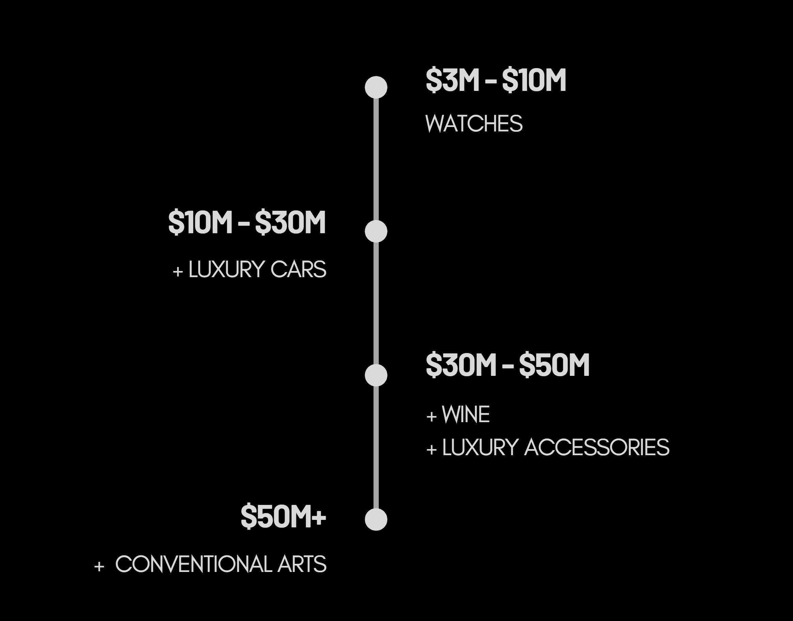
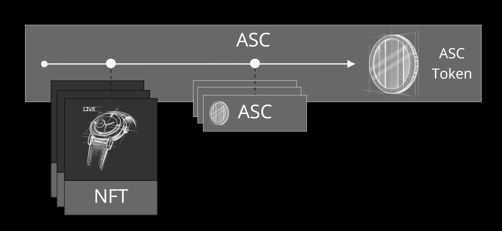
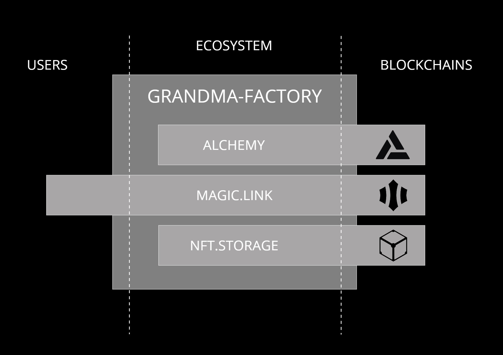

   v0.1

> La première plateforme de NFTs pour produits de luxe.

## Introduction

Grandma-Factory est une **plateforme de finance décentralisée** axée sur les produits de luxe et de collection.
Nous utilisons la technologie de la blockchain afin de proposer des actifs d'exception pour tous.

### Objectifs

Grandma-Factory propose une plateforme de finance décentralisée permettant d'investir dans de nombreux biens issus du domaine du luxe.
Les investissements judicieusement sélectionnés sur les marchés de collectionneurs peuvent être très rentables. Seule une infime minorité de la population mondiale y accède aujourd'hui. 
Grandma-Factory œuvre à changer cette réalité limitante et ouvre cette classe d'actifs à la finance décentralisée (DeFi) en proposant des biens tangibles, anti-fragiles et sûrs, à l'heure où l'incertitude économique plane dans le monde.

### Notre approche

> Grandma-Factory se base sur la Blockchain Ethereum, leader mondial de la finance décentralisée.
  
Nous utilisons des mécanismes de smart-contract éprouvés afin de proposer des **actifs robustes** et compatibles avec les outils actuels de finance décentralisée.  
Pour distribuer de la valeur sur le réseau Ethereum, Grandma-Factory créé des **NFTs** qui sont entièrement adossés à des biens réels.  
Ces NFTs sont **fractionnables** afin d'ouvrir ce marché à toutes les catégories d'investisseurs.  

Grandma-Factory structure également des fonds thématiques composés de plusieurs actifs permettant ainsi un investissement bénéficiant alors de plus de liquidité et de stabilité.  
Une application web permet de parcourir la liste des actifs gérés et d'interagir avec les différents smart-contracts de la plateforme.  

Nous souhaitons offrir aux propriétaires de biens d'exception la possibilité de les vendre au sein de notre **incubateur** pour alimenter la plateforme en nouveaux actifs.  
Ces biens doivent bien sûr être expertisés au préalable par Grandma-Factory pour fixer le prix de vente dans l'incubateur.
De plus, les frais de vente sont sensiblement inférieurs à ceux des salles des ventes. 

Grandma-Factory s'engage dans la conservation des biens que la société détient. Pour garantir la pérénité des investissements, les biens sont conservés dans les meilleures conditions de maintenance et de sécurité par Grandma-Factory.

### Roadmap

  

### Marchés ciblés

>Grandma-Factory se veut générique et s'adresse potentiellement à tous les marchés du luxe.

Plusieurs domaines sont d'ores et déjà identifiés tels que **l'horlogerie, l'automobile, les objets d'art, le vin**, et divers marchés de collectionneurs.
Grandma-Factory s'adressera aux marchés décrits ci-dessous en fonction du montant total récolté pendant l'ICO.

  

#### L'horlogerie

Le marché de la montre de luxe est porteur et incontournable. 
La montre de prestige est un segment important qui attire énormement d'investisseurs dans le monde.
Nous pouvons citer des marques emblématiques tels que, **Rolex, Audemard Piguet, Jaeger Lecoultre, Breguet**, dont certains modèles sont devenus des placements fructueux pour beaucoup de collectionneurs.

#### L'automobile

Le second marché ciblé par Grandma-Factory est l'automobile, qui compte d'innombrables adeptes.

Deux axes sont envisagés:
Celui du marché du véhicule ancien, milieu de passionnés et incontournable pour les investisseurs en quête de placement fiable.
Et celui du véhicule d'exception, souvent représenté par des voitures ultra-sportives produites en quantité très limitée.

Ce marché en plein essor à travers le monde est difficilement accessible au plus grand nombre. Grandma-Factory offre à tous les profils d'investisseurs la possibilité de se positionner sans difficulté et de manière fiable sur un marché porteur.  

#### Et bien d'autres

Grandma-Factory à la volonté de proposer un maximum de secteurs pour fournir aux détenteurs de crypto-monnaies de multiples possibilités de diversification dans leurs actifs.
Plusieurs de ces domaines, déjà identifiés, viendront enrichir la plateforme au fil du temps (oeuvres d'art, accessoires de luxe, vin...)

## La plateforme Grandma

La plateforme Grandma-Factory est accessible grâce à une application web. 
L'objectif premier de la plateforme est d'offrir à l'utilisateur un moyen efficace de parcourir les différents actifs disponibles.
Les utilisateurs peuvent consulter la liste des actifs en leurs possessions dans une rubrique dédiée.
Par ailleurs, cette application offre aux utilisateurs toutes les fonctionnalités nécessaires à l'interaction avec les différents smart-contracts.

### Grandma NFTs

Un Grandma NFT (Non-Fungible-Token) est un jeton non fongible représentant la possession numérique d'un actif réel.
**Grandma-Factory garantit que l'actif sous-jacent est conservé par ses soins et assure donc la valeur du NFT.**

Pour chaque Grandma NFT, Grandma-Factory publie les documents utiles à la valorisation de l'actif réel. 
Ces documents sont distribués sur le système de fichier IPFS (InterPlanetary File System) et sont accessibles à tout moment par les utilisateurs de la plateforme.
Les utilisateurs peuvent acheter et vendre des parts de Grandma F-NFT (detaillé ci-dessous).

### Grandma F-NFTs (Fractional-NFTs)

Un Grandma Fractional-NFT est un Grandma NFT dont la propriété est distribuée grâce à un jeton compatible avec le standard ERC-20.
Ce type de NFT permet à l'utilisateur d'acheter une fraction de NFT plutôt que l'intégralité de celui-ci. 
Il rend l'achat de NFT plus accessible et favorise la participation d'un plus grand nombre d'investisseurs dans l'écosystème.

Les Grandma F-NFTs sont listés sur la plateforme Grandma-Factory et les utilisateurs peuvent acheter ou vendre ces fractions.

### Grandma Incubator

Afin d'alimenter la plateforme en nouveaux actifs, Grandma-Factory propose aux vendeurs privés ou institutionnels de vendre leurs actifs sous forme de Grandma NFT au sein de **l'incubateur** de la plateforme. Cet incubateur permet la création de nouveaux Grandma NFT disponibles à l'achat.

Ces actifs doivent être expertisés en amont afin de les proposer à des prix pertinants en adéquation avec le marché.
Une fois leurs prix de vente atteints, Grandma-Factory procède à l'achat des biens et les conserve dans ses réserves.

Pour acheter un Grandma NFT dans l'incubateur, deux solutions s'offrent à l'utilisateur :

1. Acheter l'entièreté du Grandma NFT au prix fixé. Auquel cas, la vente est immédiatement effective.
2. Financer une fraction du Grandma NFT. Dans ce cas, si la somme des fractions vendues couvre l'intégralité du prix fixé, le NFT sera muté en F-NFT et les fractions distribuées à chaque participant.  

  

### Grandma ASCs

Grandma-Factory propose aux utilisateurs un concept nommé **AlmostStableCoin**.
Un ASC est un jeton compatible avec la norme **ERC-20**. Il a pour caractéristique d'être collatéralisé par un ensemble d'actifs Grandma.
Ainsi, il peut être composé de Grandma NFTs, de fractions de Grandma F-NFTs et également d'autres Grandma ASCs.
La valeur des jetons d'un ASC reflète la valeur cumulée des différents actifs qui le composent. 
Les ASCs sont thématiques et permettent aux investisseurs de cibler un marché tout en bénéficiant d'une diversitication sur plusieurs actifs.
Le smart-contract de l'ASC est propriétaire des actifs qui le composent et la blockchain atteste à tout moment de son état.

Les Grandma ASCs sont listés sur l'application web.
De plus, l'utilisateur peut consulter les caractéristiques techniques de chaque Grandma ASC (adresse du smart-contract, nombre de tokens, composition ect...).
Il peut également visualiser la composition de celui-ci ainsi que l'estimation du token vis-à-vis des actifs réels.

  

### Futurs services

#### Les Pools de liquidité

Les **Pools de liquidité** permettent aux utilisateurs d'investir leurs jetons (Grandma-Token & ASCs) sur la plateforme Grandma-Factory afin d'être rémunérés par différents protocoles d'échange décentralisé. 
Grandma-Factory souhaite proposer aux utilisateurs des Pools de liquidité directement sur sa plateforme. Nous distribuerons la liquidité sur les protocoles de DeFi en optimisant le rendement des Pools afin de rémunérer au mieux les participants. 

#### Les Pools d'investissement

Grandma-Factory prévoit de proposer des **Pools d'investissement** qui serviront de sas pour collecter les fonds nécessaires à la croissance des ASCs. Ces fonds seront bloqués pour une durée maximale prédéterminée et rémunérés par des jetons Grandma-Token.
Cette période de blocage sera mise à profit par Grandma-Factory pour sélectionner et acquérir les nouveaux actifs s'ajoutant a l'ASC.

A l'issue du processus, l'investisseur reçoit l'équivalence de sa participation en jeton ASC ainsi que les jetons Grandma-Token de récompense.

#### Grandma Republic

Grandma-Factory souhaite offrir aux détenteurs de Grandma-Token (GMA) la possibilité de participer aux choix des futures évolutions de la plateforme. Pour ce faire, nous mettrons en place un système communautaire de vote nommé **Grandma Republic** qui sera ouvert aux détenteurs de Grandma-Token.

L'utilisateur possédant des Grandma-Token (GMA) pourra voter pour: 
1. Ajouter un actif spécifique aux Grandma NFTs.
2. Ajouter un Grandma ASCs sur une thématique spécifique.
3. Choisir le futur domaine adressé par la plateforme.

#### Prêt de jetons

Grandma-Factory souhaite permettre aux détenteurs de jetons Grandma d'obtenir des prêts sur gage.
Ces mécanismes seront décentralisés et implémentés dans des smart-contracts.
L'utilisateur pourra demander un prêt contre le gage d'un Grandma NFT, d'un ASC, ou du Grandma-Token.
Il pourra également prêter ses actifs afin d'être rémunéré.

#### Oracles de prix

Afin d'offrir de nouvelles perspectives sur la plateforme, Grandma-Factory prévoit la mise en place d'oracles de prix pour ses différents actifs.
Ces oracles permettront d'intégrer de nouvelles fonctionnalités directement sur la blockchain en proposant des données sur les estimations des actifs aux smart-contracts.

#### OTC market

Grandma-Factory proposera un marché OTC afin de permettre aux clients privés et institutionnels d'investir en suivant un processus personnalisé et sur-mesure.

## Politique de transparence

Grandma-Factory souhaite construire un écosystème pérenne et cela se concrétise par plusieurs axes qui sont développés ci-après.

### Code Open Source

Les smart-contracts publiés par Grandma-Factory sont entièrement **Open Source** afin de proposer aux utilisateurs le maximum de transparence quant aux interactions avec la blockchain.

### Audits des smart-contracts

Les smart-contracts développés par Grandma-Factory seront audités par au moins un acteur majeur de l'audit de la finance décentralisée.
Grandma-Factory s'engage à mettre en place des programmes de récompenses pour la recherche et publication de failles de sécurité.

### Audit des actifs

Grandma-Factory souhaite donner à la communauté les moyens de vérifier les actifs détenus par la société.
Pour ce faire, Grandma-Factory sollicitera les autorités compétentes des pays dans lesquels elle détiendra les biens. 
Par exemple en France, Grandma-Factory fera appel périodiquement à des huissiers pour constater et certifier la détention des biens de la plateforme.
Les différents rapports seront publiés par Grandma-Factory afin de garantir une transparence totale. 

### Gestion des fonds de la société

Grandma-Factory conservera les crypto-actifs de la société sur la blockchain Ethereum. 
La gestion de cette réserve d'actifs crypto sera publique et rattachée au nom de domaine ENS funds.grandma-factory.eth.
Grandma-Factory s'engage à ne pas mettre en risque les fonds de la société sur quelconque plateforme de finance décentralisée/centralisée.
Grandma-Factory se réserve le droit de participer à la preuve d'enjeu du réseau Ethereum avec ses fonds inactifs.

## Economie des jetons (Tokenomics)

### Grandma-Token (GMA)

Grandma-Token (GMA) est le jeton utilitaire de la plateforme. Ce jeton a plusieurs utilités décrites ci-dessous:
1. Le GMA permet d'apporter de la liquidité sur les différents ASCs proposés sur la plateforme.
2. La GMA permet aux utilisateurs de payer les frais à prix réduit sur la plateforme.
3. La détention de GMA permet aux utilisateurs d'obtenir des récompenses en verrouillant leurs jetons.
4. La gourvernance de la plateforme Grandma-Factory implique les détenteurs de jetons GMA.
5. Le GMA sera utiliser pour rémunérer les utilisateurs pour les futurs services de la plateforme.

D'autres usages seront attribués au GMA au fur et à mesure du développement de l'écosystème.

**Caractéristiques** du jeton :

- Ticker: **GMA** 
- Chain: **Ethereum** 
- Type: **ERC777** (ERC20 Compatible)
- ICO prix d'un token: **1 GMA = 0.01 USD**
- Objectif de l'ICO: **3,000,000 USD**
- Nombre total de jetons: **10,000,000,000 GMA**
- Distribution des jetons de l'équipe: **10% tous les 3 mois**

Les jetons non vendus seront détruits à l'issue de l'ICO.

**Distribution** du jeton GMA :

- 6,000,000,000 Vente public
- 2,000,000,000 Vente privée
- 1,000,000,000 Ecosystème
- 1,000,000,000 Fond de développement

### Récompenses

Les détenteurs de Grandma-Token peuvent obtenir des avantages relatifs au nombre de jetons en leurs possession. 
Pour bénéficier de ces récompenses, l'utilisateur doit en premier lieu verrouiller des jetons sur Grandma-Factory pour une période définie.
Le verrouillage de ces jetons est compensé par l'attribution d'un NFT spécifique qui active le système de récompense sur la plateforme.

Trois niveaux de récompense sont identifiés:

- "**Coton**", pour le verrouillage de 10,000 GMA
- "**Cachemire**", pour le verrouillage de 100,000 GMA
- "**Soie**", pour le verrouillage de 1,000,000 GMA

Le premier avantage pour le détenteur d'un NFT de récompense est de bénéficier d'une réduction des frais de la plateforme.
La réduction des frais de transaction est de **5%** pour le niveau "Coton", de **15%** pour le niveau "Cachemire" et de **40%** pour le niveau "Soie".

Le second avantage est une influence accrue au sein du système Grandma Republic.
Les niveaux "Coton", "Cachemire" et "Soie"  bénéficient respectivement de **2x**, **3x** et **5x** plus d'influence dans les votes proposés à la communauté.

Ces récompenses sont communiquées à titre indicatif, Grandma-Factory se réserve le droit de les faire évoluer.

## Ecosytème technique de la plateforme

  

## Termes et conditions

La plate-forme Grandma-Factory et le jeton Grandma-Token sont des produits de la société Grandma Group LLC dont le site Web officiel est https://grandma.digital.
En accédant au site Web à l'adresse https://grandma.digital, vous acceptez d'être lié par ces conditions d'utilisation, toutes les lois et réglementations applicables, et acceptez que vous êtes responsable du respect de toutes les lois locales qui vous sont applicables. Il vous est interdit d'utiliser ou d'accéder à ce site si vous n'êtes pas en accord avec l'une de ces conditions. Le contenu de ce site Web est protégé par les lois applicables sur le droit d'auteur et les marques de commerce.

### Clause de non-responsabilité 

Ce document n'est pas une offre d'investissement ou d'achat de jetons Grandma-Token, ni d'investissement dans des titres d'entreprise ou d'un régime d'investissement collectif.
Cette campagne de financement participatif vise à soutenir le développement du projet, et les participants ne doivent rien attendre en retour. Tous les contributeurs seront récompensés comme expliqué dans les termes de la campagne. En participant à cet événement, vous comprenez que vous n'achetez pas d'art ou quoi que ce soit ayant une existence physique et que vous ne recevez que des objets numériques. Toutes les contributions des supporters sont définitives et aucun remboursement ne sera effectué. Vous acceptez également les conditions générales, la politique de confidentialité et la clause de non-responsabilité en vigueur.

Malgré le fait que le Grandma-Token soit mise en vente, nous ne recommandons pas de l'acheter à des fins d'investissement spéculatif. Les jetons Grandma-Token ne sont pas conçus à des fins d'investissement et ne doivent pas être considérés comme tels. Nous vous recommandons de consulter un conseiller professionnel en droit, finance, fiscalité ou autre pour obtenir des conseils supplémentaires avant d'envisager un achat de jetons Grandma-Token.

Nous mettons tout en oeuvre pour garantir exactes à ce jour les informations displonibles sur ce Livre blanc et sur le site Web https://grandma.digital, de tels documents ne constituent en aucun cas des conseils professionnels ou une offre contraignante. La société ne recommande pas que vous achetiez des jetons à moins que vous n'ayez une expérience préalable des jetons cryptographiques, des logiciels basés sur la blockchain et que vous ayez pris des conseils professionnels indépendants.

### Restrictions

Les citoyens, ressortissants, résidents (fiscaux ou autres) et/ou titulaires d'une carte verte en provenance :  
a) des États-Unis d'Amérique,  
b) des juridictions “call for action” telles que définies par la FATF (Financial Action Task Force),  
c) des pays reconnus par la Commission européenne, sur la base de l'article 9 de la directive (UE) 2015/849, comme présentant un risque élevé de blanchiment d'argent et de financement du terrorisme, ou présentant des lacunes stratégiques dans les réglementations AML/CFT,  
d) des pays ayant un indices de perception de la corruption de Transparency International inférieur à 20,  
e) des pays soumis à des sanctions complètes de l'OFAC,  
f) tous pays dont la législation est en conflit avec l'achat de jetons et/ou l'objectif de la société et de la plateforme en général,  
-ne sont pas autorisés à acheter des jetons.

Ce document n'est pas une offre d'investissement, ni d'achat de jetons Grandma-Token, ni d'investissement dans des valeurs mobilières ou un schéma d'investissement collectif.

Les jetons Grandma-Token n'ont pas été enregistrés en vertu de la loi sur les valeurs mobilières des États-Unis.
Les jetons ne peuvent être offerts ou vendus aux États-Unis ou à des personnes américaines que si les jetons sont enregistrés en vertu de la loi sur les valeurs mobilières, ou si une exemption de ces exigences d'enregistrement est disponible. La société ne garantit pas que cet enregistrement ou qu'une exemption seront demandées.

En aucun cas, Grandma-Factory ou ses fournisseurs ne seront responsables de tout dommage (y compris, sans s'y limiter, les dommages pour perte de données ou de profit, ou en raison d'une interruption d'activité) résultant de l'utilisation ou de l'impossibilité d'utiliser le contenu sur le site Web de Grandma-Factory, même si Grandma-Factory ou un représentant autorisé de Grandma-Factory a été informé oralement ou par écrit de la possibilité de tels dommages. Étant donné que certaines juridictions n'autorisent pas les limitations de garanties implicites ou les limitations de responsabilité pour les dommages consécutifs ou accessoires, ces limitations peuvent ne pas s'appliquer à vous.
